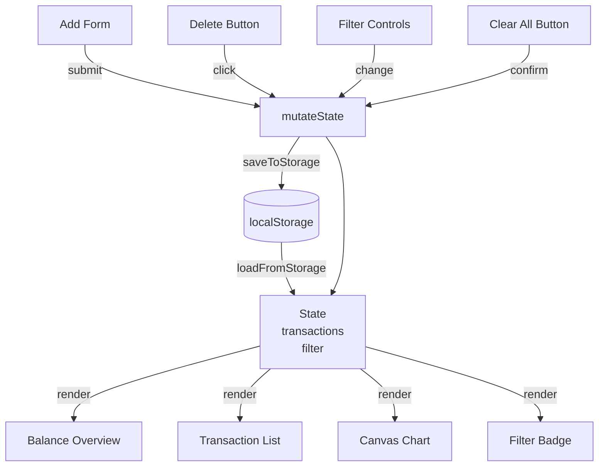

# Design Document: Expense & Budget Visualizer

## Overview

The Expense & Budget Visualizer is a single-page, client-side web application delivered as a standalone HTML file. It requires no build step, no server, and no external dependencies — everything runs in the browser using standard HTML5, CSS3, and vanilla JavaScript. Data is persisted exclusively through the browser's `localStorage` API.

The application is structured around four primary concerns:

1. **State management** — an in-memory array of transaction objects that is the single source of truth for all UI rendering.
2. **Persistence** — serializing/deserializing that array to/from `localStorage` on every mutation.
3. **Rendering** — pure functions that derive the DOM and Canvas state from the current transaction array.
4. **User interaction** — event handlers that mutate state, persist it, and trigger a re-render.

This design deliberately avoids frameworks and reactive libraries. Instead it uses a simple "mutate → persist → render" cycle that is easy to reason about and test.

---

## Architecture

### File Structure

```
index.html          ← single entry point; contains all markup
css/style.css       ← all styles (responsive, WCAG AA)
javascript/script.js ← all application logic
```

The app is intentionally kept in three files so it can be opened directly via `file://` in any modern browser without a local server.

### Application Lifecycle

```
Browser loads index.html
  └─ DOMContentLoaded fires
       ├─ loadFromStorage()   → reads localStorage, populates state.transactions[]
       ├─ bindEvents()        → attaches all event listeners (once)
       └─ render()            → draws the full UI from current state
```

Every user action follows the same cycle:

```
User action (add / delete / filter / clear)
  ├─ mutateState()    → update state.transactions[] and state.filter
  ├─ saveToStorage()  → JSON.stringify → localStorage.setItem
  └─ render()         → re-derive all UI from state
```

### Rendering Strategy

`render()` is a top-level coordinator that calls five sub-renderers:

```
render()
  ├─ renderBalance()       → updates balance, income, expense summary cards
  ├─ renderTransactionList() → rebuilds the transaction list DOM
  ├─ renderChart()         → redraws the Canvas pie/donut chart
  ├─ renderFilterBadge()   → updates the visible transaction count
  └─ renderEmptyStates()   → shows/hides empty-state messages
```

Each sub-renderer reads only from `state` and writes only to the DOM — no side effects on state.

### Mermaid Diagram — Component Interaction



---

## Components and Interfaces

### 1. State Object

```js
const state = {
  transactions: [],   // Transaction[]  — master list, always sorted newest-first
  filter: {
    category: 'all',  // string: 'all' | Category
    type: 'all',      // string: 'all' | 'income' | 'expense'
  },
  storageAvailable: true, // boolean — false if localStorage threw on init
};
```

### 2. Add Transaction Form (`#transaction-form`)

**Fields:**
| Field | Element | Validation |
|---|---|---|
| Description | `<input type="text">` | Required, non-empty after trim |
| Amount | `<input type="number">` | Required, > 0, finite |
| Category | `<select>` | Required, one of CATEGORIES |
| Type | `<select>` or radio | Required, 'income' or 'expense' |
| Date | `<input type="date">` | Required, valid date string |

**Behaviour:**
- On submit: validate all fields; if any fail, show inline `<span class="error">` beneath the offending field and abort.
- On success: call `addTransaction(formData)`, clear form, re-focus description field.
- Default date value: today's date (`new Date().toISOString().slice(0, 10)`).

**Interface:**

```js
function addTransaction(data: TransactionInput): void
// Appends a new Transaction to state.transactions, persists, re-renders.
```

### 3. Transaction List (`#transaction-list`)

Renders a `<ul>` where each `<li>` represents one transaction. Items are ordered newest-first (by date, then by insertion order for same-date items).

Each row displays: date, description, category badge, amount (color-coded), and a delete button.

**Interface:**

```js
function renderTransactionList(): void
// Derives filtered list from state, rebuilds #transaction-list innerHTML.

function deleteTransaction(id: string): void
// Removes transaction by id from state.transactions, persists, re-renders.
```

### 4. Balance Overview (`#balance-overview`)

Three summary cards:
- **Net Balance** = Σ income − Σ expenses
- **Total Income** = Σ income amounts
- **Total Expenses** = Σ expense amounts

Color convention: positive balance → green; negative → red; zero → neutral.

**Interface:**

```js
function renderBalance(): void
// Reads state.transactions, updates #balance, #total-income, #total-expenses text.
```

### 5. Spending Chart (`#chart-canvas`)

A donut chart drawn on an HTML `<canvas>` element using the Canvas 2D API. No external chart libraries.

**Behaviour:**
- Only expense transactions contribute to the chart.
- Each category slice is proportional to its share of total expenses.
- Each slice is labeled with category name + percentage (drawn inside or as a legend).
- When there are no expense transactions, the canvas is hidden and a `<p id="chart-empty">` message is shown.
- A `<ul id="chart-legend">` below the canvas maps color swatches to category names.

**Interface:**

```js
function renderChart(): void
// Aggregates expense totals by category, clears canvas, draws donut segments + legend.

function drawDonutSegment(ctx, cx, cy, r, innerR, startAngle, endAngle, color): void
// Draws a single donut arc segment.
```

### 6. Filter Controls (`#filter-controls`)

Two `<select>` elements:
- **Category filter**: options are "All Categories" + each CATEGORY constant.
- **Type filter**: options are "All Types", "Income", "Expense".

A `<span id="transaction-count">` shows "Showing N transaction(s)".

**Interface:**

```js
function applyFilter(): void
// Reads filter selects, updates state.filter, re-renders list + badge.
```

### 7. Clear All (`#clear-all-btn`)

A button that triggers `window.confirm()` for confirmation. On confirm: clears `state.transactions`, removes the `localStorage` key, re-renders everything.

**Interface:**

```js
function clearAllTransactions(): void
// Prompts user, then clears state + storage + re-renders on confirmation.
```

### 8. Storage Module

```js
const STORAGE_KEY = 'expense_visualizer_transactions';

function loadFromStorage(): Transaction[]
// Returns parsed array from localStorage, or [] on any error.
// Sets state.storageAvailable = false if localStorage throws.

function saveToStorage(transactions: Transaction[]): void
// JSON.stringifies and writes to localStorage.
// Silently catches errors; sets state.storageAvailable = false.
```

---

## Data Models

### Transaction

```js
/**
 * @typedef {Object} Transaction
 * @property {string}   id          - UUID v4 (crypto.randomUUID() or fallback)
 * @property {string}   description - User-supplied text, trimmed, non-empty
 * @property {number}   amount      - Positive finite number (stored as-is, displayed to 2dp)
 * @property {string}   category    - One of CATEGORIES
 * @property {'income'|'expense'} type
 * @property {string}   date        - ISO 8601 date string (YYYY-MM-DD)
 * @property {number}   createdAt   - Date.now() timestamp for stable sort tiebreaking
 */
```

### TransactionInput (form data before ID assignment)

```js
/**
 * @typedef {Object} TransactionInput
 * @property {string} description
 * @property {number} amount
 * @property {string} category
 * @property {'income'|'expense'} type
 * @property {string} date
 */
```

### Constants

```js
const CATEGORIES = ['Food', 'Transport', 'Entertainment', 'Health', 'Other'];

const CATEGORY_COLORS = {
  Food:          '#FF6384',
  Transport:     '#36A2EB',
  Entertainment: '#FFCE56',
  Health:        '#4BC0C0',
  Other:         '#9966FF',
};

const STORAGE_KEY = 'expense_visualizer_transactions';
```

### localStorage Schema

The entire transaction dataset is stored as a single JSON string under `STORAGE_KEY`:

```json
[
  {
    "id": "550e8400-e29b-41d4-a716-446655440000",
    "description": "Grocery run",
    "amount": 45.50,
    "category": "Food",
    "type": "expense",
    "date": "2025-07-15",
    "createdAt": 1752614400000
  }
]
```

Validation is applied on load: any item missing required fields is silently discarded to prevent corrupt data from breaking the app.

---

## Correctness Properties

*A property is a characteristic or behavior that should hold true across all valid executions of a system — essentially, a formal statement about what the system should do. Properties serve as the bridge between human-readable specifications and machine-verifiable correctness guarantees.*


### Property 1: Balance Computation Correctness

*For any* array of transactions, the displayed net balance SHALL equal the sum of all income amounts minus the sum of all expense amounts, the displayed total income SHALL equal the sum of all income amounts, and the displayed total expenses SHALL equal the sum of all expense amounts.

**Validates: Requirements 1.2, 1.3, 4.3**

---

### Property 2: Transaction Add Round-Trip

*For any* valid `TransactionInput` (non-empty description, positive finite amount, valid category, valid type, valid date), submitting the add form SHALL result in a transaction with equivalent field values being present in both `localStorage` and the rendered transaction list.

**Validates: Requirements 2.2, 7.1**

---

### Property 3: Missing-Field Validation Rejects Submission

*For any* form submission where one or more required fields (description, amount, category, type, date) are absent or empty, the system SHALL display at least one inline validation error and SHALL NOT add any new transaction to `localStorage` or the transaction list.

**Validates: Requirements 2.3**

---

### Property 4: Invalid Amount Validation Rejects Submission

*For any* form submission where the amount field is zero, negative, or non-numeric, the system SHALL display a validation error and SHALL NOT add any new transaction to `localStorage` or the transaction list.

**Validates: Requirements 2.4**

---

### Property 5: Form Reset After Successful Submission

*For any* valid transaction submission that succeeds, all form fields SHALL be cleared or returned to their default values after the transaction is saved.

**Validates: Requirements 2.5**

---

### Property 6: Transaction List Sort Order

*For any* non-empty array of transactions with varying dates, the rendered transaction list SHALL display transactions ordered from most recent date to oldest date, with ties broken by insertion order (most recently inserted first).

**Validates: Requirements 3.1**

---

### Property 7: Transaction Row Completeness

*For any* transaction in the stored dataset, its rendered row in the transaction list SHALL contain the transaction's description, amount, category, type, and date.

**Validates: Requirements 3.2**

---

### Property 8: Income/Expense Visual Distinction

*For any* pair of transactions where one has type `'income'` and the other has type `'expense'`, their rendered rows SHALL have visually distinct CSS classes or attributes that differentiate them from each other.

**Validates: Requirements 3.3**

---

### Property 9: Delete Control Presence

*For any* non-empty transaction list, every rendered transaction row SHALL contain exactly one delete control element.

**Validates: Requirements 4.1**

---

### Property 10: Transaction Delete Round-Trip

*For any* transaction present in the stored dataset, activating its delete control SHALL result in that transaction being absent from both `localStorage` and the rendered transaction list, while all other transactions remain unchanged.

**Validates: Requirements 4.2, 7.2**

---

### Property 11: Chart Data Aggregation Correctness

*For any* array of expense transactions, the data used to render the chart SHALL group transactions by category such that each category's value equals the sum of all expense amounts in that category, and the sum of all category values equals the total of all expense amounts.

**Validates: Requirements 5.1, 5.2**

---

### Property 12: Chart Rendering Completeness

*For any* non-empty set of expense transactions spanning one or more categories, the rendered chart SHALL include a percentage label for each represented category equal to `(category_total / grand_total) * 100`, and the chart legend SHALL contain an entry for every represented category.

**Validates: Requirements 5.3, 5.5**

---

### Property 13: Filter Correctness

*For any* transaction dataset and any filter state (category filter, type filter, or combination), every transaction displayed in the transaction list SHALL satisfy all active filter criteria, and no transaction satisfying all active filter criteria SHALL be omitted from the list. When the filter is reset to "all", all stored transactions SHALL be displayed.

**Validates: Requirements 6.2, 6.3**

---

### Property 14: Transaction Count Accuracy

*For any* filter state applied to any transaction dataset, the displayed transaction count SHALL equal the number of transactions currently visible in the transaction list.

**Validates: Requirements 6.4**

---

### Property 15: App Load Restores Full State

*For any* transaction dataset previously saved to `localStorage`, loading (or reloading) the application SHALL restore the transaction list, balance, income total, expense total, and chart to the state that would result from rendering that dataset fresh.

**Validates: Requirements 7.3**

---

### Property 16: Clear-All Empties All State

*For any* non-empty transaction dataset, confirming the clear-all action SHALL result in `localStorage` containing no transaction data, the transaction list being empty, and the balance, total income, and total expenses all displaying zero.

**Validates: Requirements 8.3**

---

### Property 17: Cancel Clear-All Preserves State

*For any* transaction dataset, cancelling the clear-all confirmation prompt SHALL leave `localStorage`, the transaction list, the balance, and all summary values completely unchanged.

**Validates: Requirements 8.4**

---

## Error Handling

### localStorage Unavailability

`loadFromStorage()` wraps all `localStorage` access in a `try/catch`. If `localStorage.getItem` throws (e.g., in a sandboxed iframe or private browsing mode with storage disabled), or if `JSON.parse` throws (corrupt data), the function:
1. Sets `state.storageAvailable = false`.
2. Returns an empty array.
3. After `render()` runs, a persistent `<div id="storage-warning">` banner is shown explaining that data will not be saved this session.

`saveToStorage()` similarly wraps writes in `try/catch`. If a write fails (e.g., quota exceeded), it sets `state.storageAvailable = false` and shows the warning banner.

### Form Validation Errors

Validation runs synchronously on form submit. Each field has a corresponding `<span class="field-error" aria-live="polite">` element. On validation failure:
- The relevant error spans are populated with descriptive messages.
- The first invalid field receives focus.
- The form is not submitted.

On the next successful submission, all error spans are cleared.

### Corrupt localStorage Data

On load, after parsing the JSON array, each item is validated against the Transaction schema. Items missing required fields (`id`, `description`, `amount`, `category`, `type`, `date`) are silently discarded. This prevents a single corrupt record from breaking the entire app.

### Canvas Not Supported

If `canvas.getContext('2d')` returns `null` (extremely rare in target browsers), `renderChart()` falls back to showing the empty-state message rather than throwing.

---

## Testing Strategy

### Overview

This feature uses a **dual testing approach**:
- **Unit/example tests** for specific behaviors, edge cases, and error conditions.
- **Property-based tests** for universal correctness properties across randomized inputs.

Property-based testing is appropriate here because the core logic (balance calculation, filtering, sorting, chart aggregation, persistence round-trips) consists of pure functions whose correctness must hold across a wide input space. The chosen PBT library is **[fast-check](https://github.com/dubzzz/fast-check)** for JavaScript.

### Property-Based Tests

Each property from the Correctness Properties section maps to exactly one property-based test. Tests are configured to run a minimum of **100 iterations** each.

Tag format: `// Feature: expense-budget-visualizer, Property N: <property_text>`

| Test | Property | fast-check Arbitraries |
|---|---|---|
| Balance computation | Property 1 | `fc.array(transactionArb)` |
| Add round-trip | Property 2 | `fc.record({ description: fc.string(), amount: fc.float({ min: 0.01 }), ... })` |
| Missing-field rejection | Property 3 | `fc.subarray(REQUIRED_FIELDS)` (pick fields to omit) |
| Invalid amount rejection | Property 4 | `fc.oneof(fc.constant(0), fc.float({ max: 0 }), fc.constant(NaN))` |
| Form reset | Property 5 | `transactionInputArb` |
| Sort order | Property 6 | `fc.array(transactionArb, { minLength: 2 })` |
| Row completeness | Property 7 | `fc.array(transactionArb, { minLength: 1 })` |
| Visual distinction | Property 8 | `fc.tuple(incomeArb, expenseArb)` |
| Delete control presence | Property 9 | `fc.array(transactionArb, { minLength: 1 })` |
| Delete round-trip | Property 10 | `fc.array(transactionArb, { minLength: 1 })` + index |
| Chart aggregation | Property 11 | `fc.array(expenseArb, { minLength: 1 })` |
| Chart rendering | Property 12 | `fc.array(expenseArb, { minLength: 1 })` |
| Filter correctness | Property 13 | `fc.array(transactionArb)` + `filterStateArb` |
| Count accuracy | Property 14 | `fc.array(transactionArb)` + `filterStateArb` |
| Load restores state | Property 15 | `fc.array(transactionArb)` |
| Clear-all empties state | Property 16 | `fc.array(transactionArb, { minLength: 1 })` |
| Cancel preserves state | Property 17 | `fc.array(transactionArb, { minLength: 1 })` |

### Unit / Example Tests

Unit tests cover:
- **Edge cases**: empty transaction list shows zero balance and empty-state messages; no expense transactions shows chart placeholder.
- **localStorage error handling**: mock `localStorage` to throw on `getItem` → warning banner shown, app starts empty; mock to throw on `setItem` → warning banner shown.
- **Corrupt data on load**: localStorage contains JSON with missing fields → corrupt items discarded, valid items loaded.
- **Confirmation dialog**: clear-all cancel leaves state unchanged (mock `window.confirm` returning `false`).
- **Form field presence**: all required form fields exist in the DOM.
- **Filter controls presence**: filter select elements exist in the DOM.
- **Clear-all button presence**: clear-all button exists in the DOM.

### Integration Tests

- Open `index.html` via `file://` in each target browser (Chrome, Firefox, Edge, Safari) and verify:
  - Add a transaction → appears in list, balance updates, chart updates.
  - Reload page → data persists.
  - Delete a transaction → removed from list, balance updates.
  - Clear all → list empty, balance zero.

### Accessibility Checks

- Run axe-core against the rendered DOM to verify WCAG 2.1 Level AA color contrast and ARIA attributes.
- Manual keyboard navigation test: Tab through all interactive elements, verify focus order and operability.
- Manual touch test on a mobile device at 320px viewport width.
